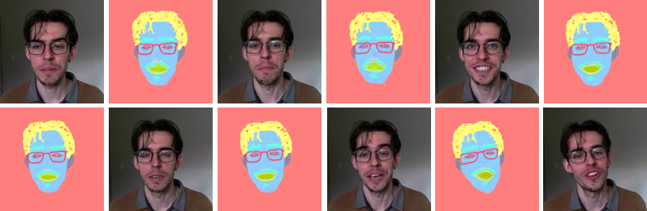

## DeepSIM Colab ##

[](https://colab.research.google.com/github/levifussell/DeepSIM/blob/master/notebooks/DeepSIM_colab_notebook.ipynb)

This code is a fork of the [DeepSIM code base](https://github.com/eliahuhorwitz/DeepSIM), with minor edits to make it run in a colab notebook. I was interested in applying this model to my own datasets but didn't have the local machine power and so edited to work with colab. The colab notebook can be found [here](https://colab.research.google.com/github/levifussell/DeepSIM/blob/master/notebooks/DeepSIM_colab_notebook.ipynb) and includes written instructions on how to run it. The example in the colab has the original datasets, as well as an additional dataset for overlaying an animation over my face.

This is based off of research by the original authors from the paper [DeepSIM: Image Shape Manipulation from a Single Augmented Training Sample](https://arxiv.org/abs/2109.06151). Here are links to the original [code base](https://github.com/eliahuhorwitz/DeepSIM) and [project page](http://www.vision.huji.ac.il/deepsim/).


## Getting Started

All the information for running this code base on your own dataset can be found on the [colab notebook](https://colab.research.google.com/github/levifussell/DeepSIM/blob/master/notebooks/DeepSIM_colab_notebook.ipynb). If you want to run this code locally without colab, then see [the original](https://github.com/eliahuhorwitz/DeepSIM) code base for well documented instructions.

## Citation

If you wish to reference this code base, please only reference _this_ code if you made use of any of the colab-based code. Otherwise reference the original authors' [code](https://github.com/eliahuhorwitz/DeepSIM) only. If you do reference this repository, please include a reference to the original authors: 

```
@misc{vinker2020deep,
    title={Deep Single Image Manipulation},
    author={Yael Vinker and Eliahu Horwitz and Nir Zabari and Yedid Hoshen},
    year={2020}, 
    eprint={2007.01289},
    archivePrefix={arXiv},
}
```
